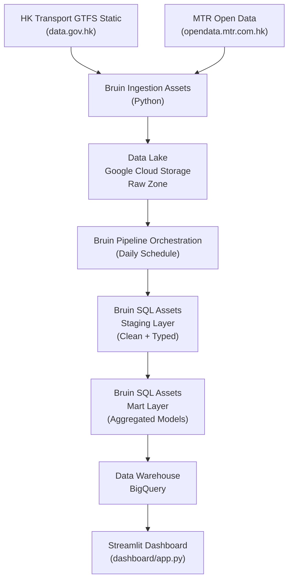

# Hong Kong Transit Pulse — 香港交通脈搏

An end-to-end data engineering pipeline for Hong Kong public transport data, built with **Bruin** as the core orchestration and transformation engine.

> **Data Engineering Zoomcamp 2026 — Capstone Project** · Deadline: April 21, 2026

---

## Problem Statement

Hong Kong runs one of the world's most complex public transport networks — MTR heavy rail, Light Rail, over 700 bus routes, trams, and ferries — yet the data describing how these systems actually perform sits scattered across multiple government portals in raw GTFS files and CSV exports that are difficult for the public to interpret.

This project builds a structured batch pipeline to answer:

- Which stops and routes are most heavily used?
- How does service differ between weekdays and weekends?
- Which areas are underserved by public transport?
- When do first and last services run on each route?
- How do MTR and bus networks complement each other geographically?

---

## Architecture



---

## Stack

| Layer | Tool |
|---|---|
| Orchestration | Bruin |
| Infrastructure | OpenTofu |
| Data Lake | Google Cloud Storage |
| Data Warehouse | BigQuery |
| Streaming | Confluent Kafka |
| Visualization | Streamlit + pydeck |
| Cloud | GCP (Free Tier) |

---

## Project Structure

```
hk-transit-pulse/
├── .bruin.yml                          # Bruin project config + GCP connection (gitignored)
├── pipeline.yml                        # Pipeline definition + daily schedule
├── requirements.txt                    # Python dependencies
├── assets/
│   ├── ingestion/
│   │   ├── ingest_gtfs_static.py       # Download GTFS ZIP -> GCS -> BigQuery
│   │   └── ingest_mtr_csv.py           # Fetch MTR CSVs -> GCS -> BigQuery
│   ├── staging/
│   │   ├── stg_stops.sql
│   │   ├── stg_routes.sql
│   │   ├── stg_trips.sql
│   │   ├── stg_stop_times.sql
│   │   └── stg_calendar.sql
│   └── marts/
│       ├── mart_stops_ranked.sql
│       ├── mart_trips_per_route.sql
│       ├── mart_peak_hour_analysis.sql
│       ├── mart_route_service_hours.sql
│       ├── mart_service_frequency.sql
│       ├── mart_transfer_hubs.sql
│       ├── mart_weekday_vs_weekend.sql
│       ├── mart_longest_routes.sql
│       ├── mart_early_night_routes.sql
│       └── mart_trip_trajectories.sql
├── dashboard/
│   └── app.py                          # Streamlit dashboard
├── streaming/
│   ├── config.py
│   ├── producer.py
│   └── consumer.py
└── terraform/
    ├── main.tf                         # GCS + BigQuery + service account + IAM
    ├── variables.tf
    ├── outputs.tf
    └── terraform.tfvars.example
```

---

## BigQuery Layout

```
<GCP_PROJECT_ID>/
├── raw/
│   ├── gtfs_routes
│   ├── gtfs_stops
│   ├── gtfs_trips
│   ├── gtfs_stop_times
│   ├── gtfs_calendar
│   ├── mtr_lines_stations
│   ├── mtr_bus_stops
│   ├── mtr_fares
│   └── mtr_light_rail_stops
├── staging/
│   ├── stg_stops
│   ├── stg_routes
│   ├── stg_trips
│   ├── stg_stop_times
│   └── stg_calendar
└── marts/
    ├── mart_stops_ranked
    ├── mart_trips_per_route
    ├── mart_peak_hour_analysis
    ├── mart_route_service_hours
    ├── mart_service_frequency
    ├── mart_transfer_hubs
    ├── mart_weekday_vs_weekend
    ├── mart_longest_routes
    ├── mart_early_night_routes
    └── mart_trip_trajectories
```

All datasets are in the **US** region.

---

## Data Sources

**GTFS Static Feed** — `https://static.data.gov.hk/td/pt-headway-en/gtfs.zip`

| File | Contents |
|---|---|
| routes.txt | Bus/tram/ferry routes |
| stops.txt | Stop locations + coordinates |
| trips.txt | Individual trips per route |
| stop_times.txt | Arrivals/departures per stop |
| calendar.txt | Weekday vs weekend service days |

> Note: MTR does not publish GTFS — trip-level data is not publicly available.

**MTR Open Data** — `https://opendata.mtr.com.hk`

| Table | Contents |
|---|---|
| mtr_lines_stations | Heavy rail lines and stations |
| mtr_bus_stops | MTR feeder bus stops and routes |
| mtr_fares | Station-to-station fare table |
| mtr_light_rail_stops | Light Rail routes and stops |

---

## Setup

### Prerequisites

- [WSL](https://learn.microsoft.com/en-us/windows/wsl/install) (Windows)
- [Bruin CLI](https://getbruin.com)
- [OpenTofu](https://opentofu.org)
- [gcloud CLI](https://cloud.google.com/sdk/docs/install)
- GCP project with billing enabled

### 1. GCP Authentication

```bash
gcloud auth application-default login --no-browser
gcloud auth application-default set-quota-project <GCP_PROJECT_ID>
export GOOGLE_APPLICATION_CREDENTIALS=~/.config/gcloud/application_default_credentials.json
```

### 2. Provision Infrastructure

```bash
cd terraform
cp terraform.tfvars.example terraform.tfvars
# Fill in your project_id in terraform.tfvars
tofu init && tofu apply
```

### 3. Configure Bruin

Edit `.bruin.yml`:

```yaml
default_environment: default
environments:
  default:
    connections:
      google_cloud_platform:
        - name: gcp
          project_id: <GCP_PROJECT_ID>
          location: US
          use_application_default_credentials: true
```

### 4. Install Python Dependencies

```bash
pip install -r requirements.txt
```

### 5. Run the Pipeline

```bash
# Validate all assets
bruin validate

# Run full pipeline
bruin run

# Run individual layers
bruin run assets/ingestion/ingest_gtfs_static.py
bruin run assets/ingestion/ingest_mtr_csv.py
bruin run assets/staging/stg_stops.sql
bruin run assets/marts/mart_stops_ranked.sql
```

### 6. Run the Dashboard

```bash
streamlit run dashboard/app.py
```

---

## About

Built by **Rizal**, an Indonesian data engineer based in Jakarta with a keen interest in urban mobility, open government data, and Hong Kong cinema.
