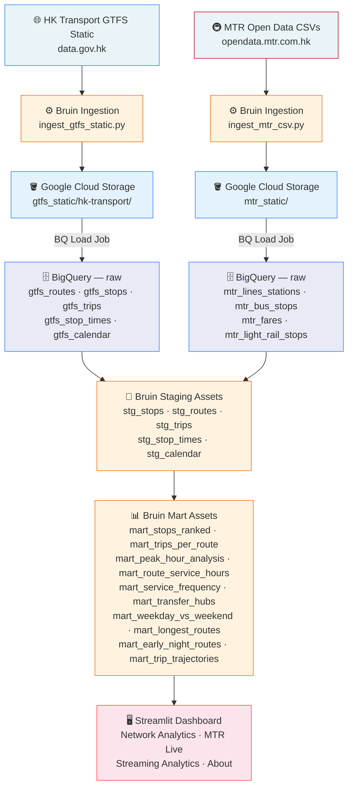

# Hong Kong Transit Pulse — 香港交通脈搏


> **Data Engineering Zoomcamp 2026 — Capstone Project**

---

## Problem Statement

Hong Kong runs one of the world's most complex public transport networks — MTR heavy rail, Light Rail, over 700 bus routes, trams, and ferries — yet the data describing how these systems actually perform sits scattered across multiple government portals in raw GTFS files and CSV exports that are difficult for the public to interpret.

This project builds a structured batch pipeline to answer:

- Which stops and routes are most heavily used?
- How does service differ between weekdays and weekends?
- Which areas are underserved by public transport?
- When do first and last services run on each route?
- How do MTR and bus networks complement each other geographically?

---

## Overview

Hong Kong Transit Pulse is an end-to-end batch data engineering pipeline that ingests raw GTFS feeds and MTR open data, transforms them into analytics-ready models, and surfaces insights via an interactive Streamlit dashboard.

The pipeline runs daily, pulling from two open data sources — HK Transport (GTFS) and MTR Corporation — loading them into Google Cloud Storage, transforming through BigQuery layers (raw → staging → marts), and visualising in a 4-tab dashboard with a real-time streaming layer on top.

---

## Table of Contents

- [Tech Stack](#tech-stack)
- [Architecture](#architecture)
- [Project Structure](#project-structure)
- [Data Sources](#data-sources)
- [Data Pipeline](#data-pipeline)
- [Insights & Visualizations](#insights--visualizations)
- [Steps to Reproduce](#steps-to-reproduce)
- [About](#about)

---

## Tech Stack

      

| Layer | Tool | Purpose |
|---|---|---|
| Orchestration | Bruin | Pipeline orchestration + SQL transformations |
| Infrastructure | OpenTofu | Provision GCS, BigQuery, service accounts |
| Data Lake | Google Cloud Storage | Raw zone for GTFS and MTR files |
| Data Warehouse | BigQuery | raw → staging → marts layers |
| Streaming | Apache Kafka | Real-time MTR event stream |
| Visualization | Streamlit + pydeck | Interactive dashboard (4 tabs) |
| Cloud | GCP Free Tier | Compute, storage, and warehouse |
| Language | Python 3.11 | Ingestion scripts and dashboard |

---

## Architecture



The data flow proceeds through the following steps:

1. **Ingestion** — Bruin Python assets fetch GTFS ZIP and MTR CSVs daily, uploading raw files to Google Cloud Storage.
2. **Raw Load** — BigQuery load jobs (WRITE_TRUNCATE) load GCS files into the `raw` dataset with schema autodetection.
3. **Staging** — Bruin SQL assets clean, type-cast, and rename columns into the `staging` dataset.
4. **Marts** — Bruin SQL mart assets aggregate staging data into 10 analytics-ready tables in the `marts` dataset.
5. **Visualization** — The Streamlit dashboard queries marts directly via the BigQuery Python client.

---

## Project Structure

```
hk-transit-pulse/
├── .bruin.yml                          # Bruin project config + GCP connection (gitignored)
├── pipeline.yml                        # Pipeline definition + daily schedule
├── requirements.txt                    # Python dependencies
├── assets/
│   ├── ingestion/
│   │   ├── ingest_gtfs_static.py       # Download GTFS ZIP -> GCS -> BigQuery
│   │   └── ingest_mtr_csv.py           # Fetch MTR CSVs -> GCS -> BigQuery
│   ├── staging/
│   │   ├── stg_stops.sql
│   │   ├── stg_routes.sql
│   │   ├── stg_trips.sql
│   │   ├── stg_stop_times.sql
│   │   └── stg_calendar.sql
│   └── marts/
│       ├── mart_stops_ranked.sql
│       ├── mart_trips_per_route.sql
│       ├── mart_peak_hour_analysis.sql
│       ├── mart_route_service_hours.sql
│       ├── mart_service_frequency.sql
│       ├── mart_transfer_hubs.sql
│       ├── mart_weekday_vs_weekend.sql
│       ├── mart_longest_routes.sql
│       ├── mart_early_night_routes.sql
│       └── mart_trip_trajectories.sql
├── dashboard/
│   └── app.py                          # Streamlit dashboard (4 tabs)
├── streaming/
│   ├── config.py
│   ├── producer.py
│   └── consumer.py
└── terraform/
    ├── main.tf                         # GCS + BigQuery + service account + IAM
    ├── variables.tf
    ├── outputs.tf
    └── terraform.tfvars.example
```

---

## Data Sources

### HK Transport GTFS Static
**URL:** `https://static.data.gov.hk/td/pt-headway-en/gtfs.zip`

| File | Contents |
|---|---|
| routes.txt | Bus, tram, and ferry routes |
| stops.txt | Stop locations + coordinates |
| trips.txt | Individual trips per route |
| stop_times.txt | Arrivals/departures per stop |
| calendar.txt | Weekday vs weekend service days |

> Covers KMB buses, CTB/NWFB citybus, trams, and ferries. Updated daily. MTR does **not** publish GTFS — trip-level data is not publicly available.

### MTR Open Data
**URL:** `https://opendata.mtr.com.hk`

| Table | Contents |
|---|---|
| mtr_lines_stations | Heavy rail lines and stations |
| mtr_bus_stops | MTR feeder bus stops and routes |
| mtr_fares | Station-to-station fare table |
| mtr_light_rail_stops | Light Rail routes and stops |

---

## Data Pipeline

### 1. Ingestion

Two Bruin Python assets handle data extraction:

- `ingest_gtfs_static.py` — Downloads the GTFS ZIP from data.gov.hk, extracts individual files, uploads to GCS, then runs BigQuery load jobs.
- `ingest_mtr_csv.py` — Fetches 4 MTR CSVs, normalises column names, strips UTF-8 BOM, uploads to GCS, then loads to BigQuery.

Both run under the `hk-transit-pipeline` Bruin pipeline on a daily cron schedule.

### 2. Staging

Five Bruin SQL assets clean and standardise raw data:

| Asset | Source | Key transformations |
|---|---|---|
| `stg_stops` | `raw.gtfs_stops` | Rename lat/lon, cast types |
| `stg_routes` | `raw.gtfs_routes` | Map route_type codes |
| `stg_trips` | `raw.gtfs_trips` | Join route metadata |
| `stg_stop_times` | `raw.gtfs_stop_times` | Parse HH:MM:SS times |
| `stg_calendar` | `raw.gtfs_calendar` | Boolean weekday flags |

### 3. Marts

Ten aggregated mart models power the dashboard:

| Mart | Description |
|---|---|
| `mart_stops_ranked` | Stops ranked by total departures |
| `mart_trips_per_route` | Trip count per route |
| `mart_peak_hour_analysis` | Trips by hour of day |
| `mart_route_service_hours` | First and last service per route |
| `mart_service_frequency` | Average headway per route |
| `mart_transfer_hubs` | Stops served by multiple routes |
| `mart_weekday_vs_weekend` | Service count split by day type |
| `mart_longest_routes` | Routes ranked by stop count |
| `mart_early_night_routes` | Routes with earliest/latest services |
| `mart_trip_trajectories` | Route paths for map rendering |

### 4. BigQuery Layout

```
<GCP_PROJECT_ID>/
├── raw/          ← loaded from GCS via BQ load jobs
├── staging/      ← Bruin SQL staging assets
└── marts/        ← Bruin SQL mart assets (aggregated)
```

All datasets are in the **US** region.

---

## Insights & Visualizations

The Streamlit dashboard (`dashboard/app.py`) has 4 tabs:

**Network Analytics** — GTFS-based charts filtered by transport type (Bus, Tram, Ferry, Peak Tram):
- Stop locations map (pydeck)
- Top 10 busiest stops
- Top 20 routes by trip count
- Departures by hour of day
- Weekday vs weekend service comparison
- Transfer hubs, longest routes, early/late services

**MTR Live 港鐵** — MTR-specific data from open data CSVs:
- Heavy rail network (lines and stations)
- Light Rail routes and stops

**Streaming Analytics 實時分析** — Real-time event stream via Kafka:
- Events per MTR line
- Event volume over time
- UP vs DOWN train breakdown

**About** — Project background and data sources.

---

## Steps to Reproduce

### Prerequisites

- [WSL](https://learn.microsoft.com/en-us/windows/wsl/install) (Windows users)
- [Bruin CLI](https://getbruin.com)
- [OpenTofu](https://opentofu.org)
- [gcloud CLI](https://cloud.google.com/sdk/docs/install)
- GCP project with billing enabled
- Python 3.11+

### 1. Clone the Repository

```bash
git clone https://github.com/MFarizalA/hk-transit-pulse.git
cd hk-transit-pulse
```

### 2. GCP Authentication

```bash
gcloud auth application-default login --no-browser
gcloud auth application-default set-quota-project <GCP_PROJECT_ID>
export GOOGLE_APPLICATION_CREDENTIALS=~/.config/gcloud/application_default_credentials.json
export GOOGLE_CLOUD_PROJECT=<GCP_PROJECT_ID>
```

### 3. Provision Infrastructure

```bash
cd terraform
cp terraform.tfvars.example terraform.tfvars
# Fill in your project_id in terraform.tfvars
tofu init && tofu apply
```

This creates the GCS bucket, BigQuery datasets (`raw`, `staging`, `marts`), and a service account.

### 4. Configure Bruin

Copy and edit `.bruin.yml`:

```bash
cp .bruin.yml.example .bruin.yml
```

```yaml
default_environment: default
environments:
  default:
    connections:
      google_cloud_platform:
        - name: gcp
          project_id: <GCP_PROJECT_ID>
          location: US
          use_application_default_credentials: true
```

### 5. Install Python Dependencies

```bash
pip install -r requirements.txt
```

### 6. Run the Pipeline

```bash
# Validate all assets
bruin validate

# Run full pipeline (ingestion -> staging -> marts)
bruin run

# Or run individual layers
bruin run assets/ingestion/ingest_gtfs_static.py
bruin run assets/ingestion/ingest_mtr_csv.py
bruin run assets/staging/stg_stops.sql
bruin run assets/marts/mart_stops_ranked.sql
```

### 7. Run the Dashboard

```bash
streamlit run dashboard/app.py
```

---

## About

Built by **Rizal**, an Indonesian data engineer based in Jakarta with a keen interest in urban mobility, open government data, and Hong Kong cinema.

📧 Reach out via [GitHub](https://github.com/MFarizalA)
